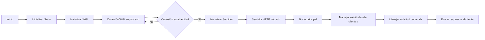

# Practica 3.A: Connexión Wifi. Página web básica.
## Objetivo: 
- El objetivo principal de este proyecto es conectar una conexión Wifi con nuestro ESP32-S3 y crear una pagina web (basica). 
## Materiales:
- ESP32-S3
## Procedimiento:
**Codigo:** 
```cpp
    #include <Arduino.h>
    #include <WiFi.h>
    #include <WebServer.h>

    void handle_root();

    // SSID & Password
    const char* ssid = "Nombre"; // Debe introducir el nombre de su SSID.
    const char* password = "Contraseña"; // Debe introducir la contraseña.

    WebServer server(80); // Objeto de la libreria WebServer, con puerto HTTP 80 por defecto

    void setup(){
        Serial.begin(115200);
        Serial.println("Conectando a la red WiFi...");
        Serial.println(ssid);
        WiFi.begin(ssid, password);
        while (WiFi.status() != WL_CONNECTED) {
            delay(1000);
            Serial.print(".");
        }
        Serial.println("");
        Serial.println("Conexión WiFi establecida");
        Serial.print("Dirección IP: ");
        Serial.println(WiFi.localIP());

        server.on("/", handle_root);
        server.begin();
        Serial.println("HTTP server started");
        delay(100);
    }

    void loop() {
        server.handleClient();
    }

    // HTML & CSS contents which display on web server
    // Crecion contenido de la pagina web de prueba, básica: 
    String HTML = "<!DOCTYPE html>\
    <html>\
    <body>\
    <h1>My Primera Pagina con ESP32 - Station Mode &#128522;</h1>\
    </body>\
    </html>";
    // Handle root url (/)

    void handle_root() {
        server.send(200, "text/html", HTML);
    }
```
**Descripción:**<br>
En este programa conectamos  nuestro ESP32-S3 a una red WiFi y creamos un servidor Web. El programa nos ha de avisa cuando haya aconseguido conectarse a la red y mostrar la dirección IP de la pagina con la que podremos acceder a nuestra pagina. <br>
En la función loop(), se llama al método handleClient() del servidor web para manejar las solicitudes de los clientes web.<br>
La función handle_root() envía una respuesta HTML al cliente web cuando se accede a la ruta raíz. La respuesta contiene el contenido HTML almacenado en la variable HTML, que representa una página web básica con un encabezado.

**Salida terminal:**
```
    Conexión WiFi establecida
    Dirección IP: 192.168.58.26
    HTTP server started
```
**Diagrama de flujos:**



## Conclusión: 
Establece un servidor web simple en un ESP32 que muestra una página HTML básica cuando se accede a la dirección IP del dispositivo desde un navegador web.